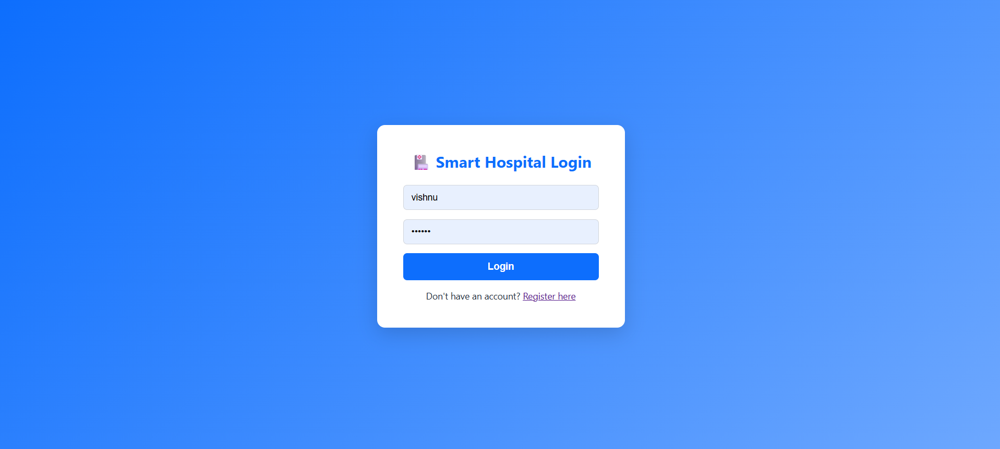
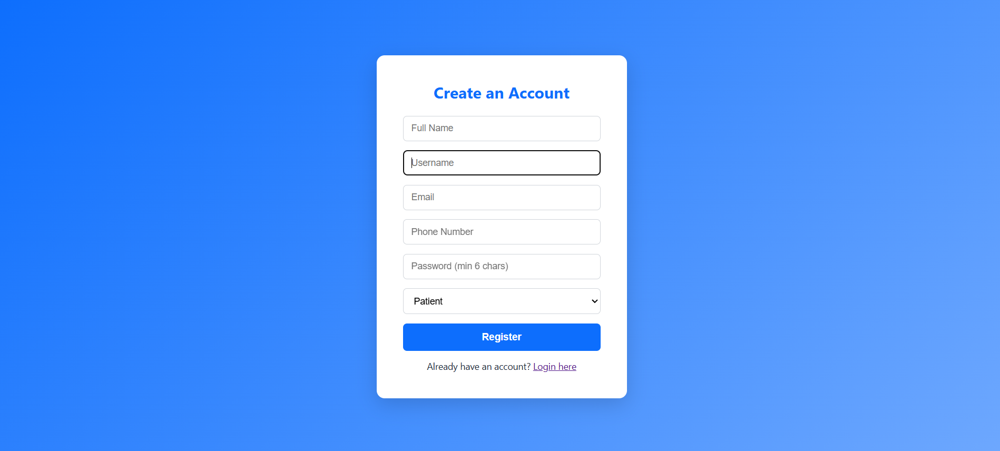
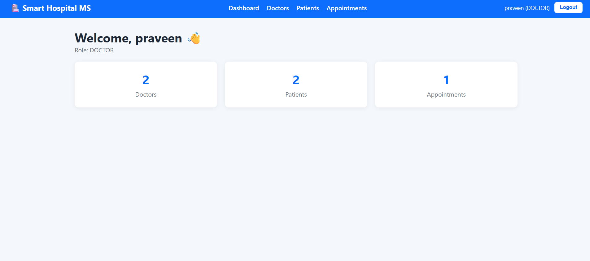
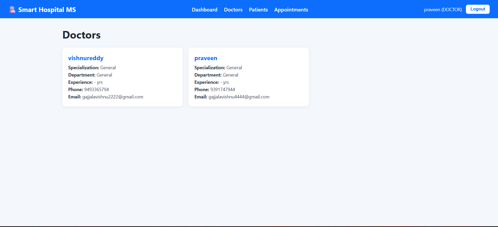
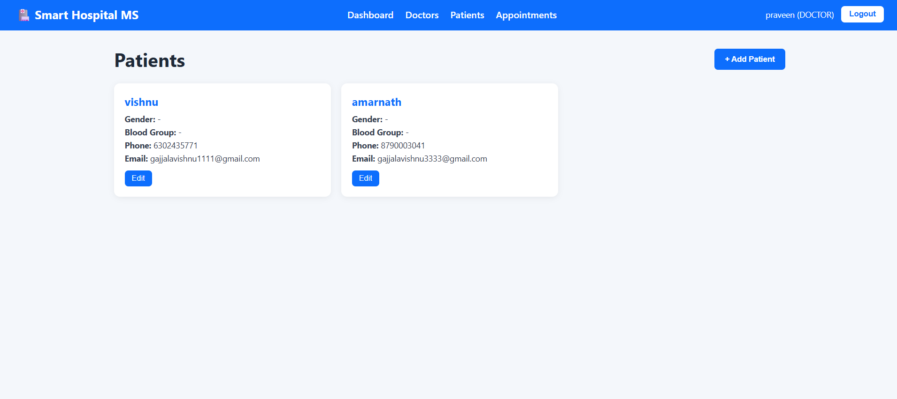
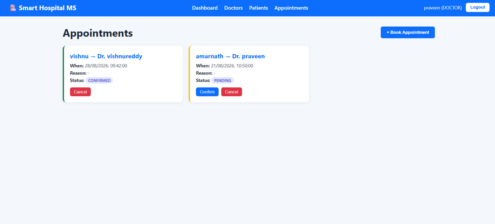

# Smart Hospital Management System

A full-stack hospital management application built with **Spring Boot** (Java, REST APIs, Spring Security + JWT), **React.js** (with HTML/CSS/JavaScript), and **MySQL**.

## Features

- **Authentication**: JWT-based login/registration with role-based access (ADMIN, DOCTOR, PATIENT)
- **Doctor Management**: Add, view, update, delete doctor records
- **Patient Management**: Add, view, update, delete patient records
- **Appointment Booking**: Book, confirm, cancel appointments between patients and doctors
- **Dashboard**: Live stats overview (total doctors, patients, appointments)
- **Secure REST APIs**: Protected with Spring Security and JWT filters
- **Responsive UI**: Clean React frontend with custom CSS (no UI framework dependency)

## Tech Stack

| Layer      | Technology                                      |
|------------|--------------------------------------------------|
| Frontend   | React.js, HTML5, CSS3, JavaScript (ES6+), Axios, React Router |
| Backend    | Java 17, Spring Boot 3, Spring Security, Spring Data JPA, JWT (jjwt) |
| Database   | MySQL 8                                          |
| Build Tools| Maven (backend), npm (frontend)                  |

## Project Structure

```
smart-hospital-management/
├── backend/                          # Spring Boot application
│   ├── pom.xml
│   └── src/main/java/com/hospital/smarthospital/
│       ├── SmartHospitalApplication.java
│       ├── config/SecurityConfig.java
│       ├── security/JwtUtil.java, JwtAuthFilter.java
│       ├── model/User.java, Doctor.java, Patient.java, Appointment.java, Role.java, AppointmentStatus.java
│       ├── repository/                (Spring Data JPA repositories)
│       ├── service/                   (business logic)
│       ├── controller/                (REST endpoints)
│       ├── dto/                       (request/response objects)
│       ├── exception/GlobalExceptionHandler.java
│       └── resources/application.properties
├── frontend/                         # React application
│   ├── package.json
│   ├── public/index.html
│   └── src/
│       ├── App.js, index.js
│       ├── api/axiosConfig.js
│       ├── context/AuthContext.js
│       ├── components/Navbar.js, DoctorCard.js, PatientCard.js, AppointmentCard.js
│       ├── pages/Login.js, Register.js, Dashboard.js, Doctors.js, Patients.js, Appointments.js
│       └── css/index.css
├── database/schema.sql               # Reference SQL schema
└── README.md
```

## Setup Instructions

### 1. Database Setup
Make sure MySQL is running, then either let Spring Boot auto-create the schema, or run manually:
```bash
mysql -u root -p < database/schema.sql
```

### 2. Backend Setup
```bash
cd backend
# Edit src/main/resources/application.properties with your MySQL username/password
mvn clean install
mvn spring-boot:run
```
The backend runs on **http://localhost:8080**

### 3. Frontend Setup
```bash
cd frontend
npm install
npm start
```
The frontend runs on **http://localhost:3000**

## API Endpoints Overview

| Method | Endpoint                          | Description                     |
|--------|------------------------------------|----------------------------------|
| POST   | /api/auth/register                 | Register new user                |
| POST   | /api/auth/login                    | Login and receive JWT token      |
| GET    | /api/doctors                       | List all doctors                 |
| POST   | /api/doctors                       | Add doctor (ADMIN only)          |
| PUT    | /api/doctors/{id}                  | Update doctor                    |
| DELETE | /api/doctors/{id}                  | Delete doctor (ADMIN only)       |
| GET    | /api/patients                      | List all patients (ADMIN/DOCTOR) |
| POST   | /api/patients                      | Add patient                      |
| PUT    | /api/patients/{id}                 | Update patient                   |
| DELETE | /api/patients/{id}                 | Delete patient (ADMIN only)      |
| GET    | /api/appointments                  | List all appointments            |
| POST   | /api/appointments                  | Book an appointment              |
| PUT    | /api/appointments/{id}/status      | Update appointment status        |
| DELETE | /api/appointments/{id}             | Cancel an appointment            |

## Resume Bullet Points (suggested)

- Developed a full-stack **Smart Hospital Management System** using **Java, Spring Boot, Spring Security (JWT), React.js, and MySQL**, implementing role-based access control for Admin, Doctor, and Patient user types.
- Designed and built **RESTful APIs** for patient records, doctor management, and appointment scheduling, secured with JWT authentication and BCrypt password encryption.
- Built a responsive **React.js frontend** with protected routing, Context API for auth state management, and Axios interceptors for token handling.
- Modeled a normalized **MySQL** relational schema with JPA/Hibernate, covering Users, Doctors, Patients, and Appointments with proper foreign key relationships.

## Notes

- Default `ddl-auto=update` means tables are auto-created on first run — no manual SQL needed unless you prefer it.
- Update the JWT secret in `application.properties` before deploying to production.
- CORS is pre-configured for `http://localhost:3000`.

- ## Screenshots

### Login Page





### Register Page





### Dashboard





### Doctor Management





### Patient Management





### Appointments



